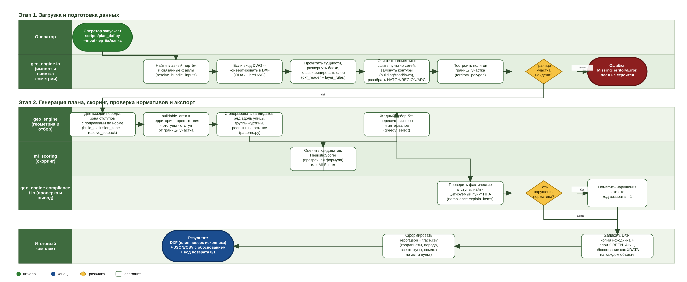

# GreenProject — техническая документация к сдаче

Сервис автоматического проектирования городского озеленения с учётом отступов от инженерных сетей. Хакатон ЛЦТ2026, задача Департамента природопользования и охраны окружающей среды г. Москвы («Сервис для автоматического проектирования озеленения города с учётом расположения подземных коммуникаций и городской среды»).

Этот документ закрывает обязательный по ТЗ пункт «документация в электронном виде (.doc/.pdf, либо .md с экспортом в PDF)» и содержит всё перечисленное там же: назначение и область применения, архитектуру, описание алгоритма со схемой процесса, применённые методы/библиотеки со ссылками на источники, порядок сборки/запуска/проверки под целевую ОС, способы взаимодействия с системой и ограничения/допущения/известные проблемы.

## 1. Назначение и область применения

Сервис принимает чертёж территории (DXF/DWG, в реальной поставке — чертёж + внешние ссылки на смежные листы: сети, границы участка) и предлагает план посадки деревьев, кустарников и газона, соблюдающий нормативные отступы от:

- инженерных сетей (теплосеть, водопровод, канализация, газопровод, силовой кабель, ЛЭП);
- зданий и сооружений (в т.ч. усиленно — от школ и детских садов);
- дорог, тротуаров, трамвайных путей, опор освещения, подпорных стенок, границы самого участка.

Результат — тот же чертёж с новым слоем посадок поверх исходного (как требует ТЗ: «результат размещается на отдельном слое, исходные данные не удаляются»), плюс машиночитаемое обоснование каждой позиции со ссылкой на пункт норматива, плюс отчёт по всему плану.

ТЗ прямо определяет приоритеты: «Главное — рабочий алгоритм и/или обученная/настроенная ИИ-модель... Второстепенно — UX/UI... Достаточно CLI... Слабый алгоритм при отличном UI оценивается ниже, чем точный пайплайн с минимальным способом запуска». Сервис построен по этому принципу: основной сдаваемый артефакт — консольный пайплайн `scripts/plan_dxf.py` (раздел 8), не требующий ни базы данных, ни браузера, ни сети. Веб-приложение (backend + карта на фронтенде) — полностью рабочая, но вторичная надстройка для интерактивной правки плана человеком.

## 2. Схема процесса



Диаграмма (BPMN-подобная нотация, дорожки — участники процесса) описывает единый пайплайн, которым пользуются и CLI (`scripts/plan_dxf.py`), и backend (`pipeline_service.py`) — оба вызывают одни и те же функции `geo_engine`, отличается только то, что происходит на входе (файл vs. HTTP-запрос) и на выходе (файл на диске vs. фоновая задача + скачивание).

Два решающих узла на схеме — не декоративные: «граница участка найдена?» действительно останавливает пайплайн честной ошибкой (`MissingTerritoryError`), если ни один слой чертежа не даёт замкнутого контура территории (живой случай — см. раздел 11); «есть нарушения норматива?» не блокирует экспорт, а помечает нарушения в отчёте и возвращает код завершения процесса `1` — ручная правка допускается и после генерации, поэтому итоговый план может содержать сознательно оставленные нарушения, о которых пользователь должен знать явно.

## 3. Архитектура

Подробная карта кода — [docs/architecture.md](architecture.md). Коротко: монорепозиторий из двух независимых Python-пакетов без единого импорта FastAPI (`geo_engine` — геометрия и нормативная логика, `ml_scoring` — скоринг кандидатов) и слоя-склейки (`backend/`, только там они импортируются вместе). Это осознанное разделение — оба пакета тестируются и используются отдельно от сервера, а `scripts/plan_dxf.py` работает вообще без единой строчки FastAPI/базы данных.

База данных отсутствует по прямой просьбе заказчика решения (подробное обоснование — [docs/decision_log.md](decision_log.md)): вся работа веб-версии — загрузили территорию, поработали в одной сессии, экспортировали результат — укладывается в модель «состояние проекта живёт в памяти процесса backend», без сохранения между перезапусками. Для консольного пайплайна вопрос не возникает вовсе — там нет ни сервера, ни сессии.

## 4. Алгоритм — пошагово, с источниками решений

1. **Разбор бандла файлов.** Реальная поставка — не один DXF: главный чертёж ссылается на внешние файлы (`Xrefs/`, `ссылки/`, отдельные папки по номеру заказа на съёмку сетей). `geo_engine/io/dxf_reader.py::resolve_bundle_inputs()` находит главный чертёж (по объёму содержимого, не по имени файла — реальные имена оказались ненадёжны, см. раздел 11) и всё, что ему принадлежит, рекурсивно.
2. **DWG → DXF.** `ezdxf` не читает DWG напрямую. `geo_engine/io/dwg_convert.py` умеет ODA File Converter (основной путь — единственный, кто восстанавливает настоящую ACIS-геометрию `REGION`/`3DSOLID`, т.е. заливки типов покрытия) и LibreDWG 0.14+ (фолбэк, если ODA недоступна в окружении).
3. **Чтение сущностей и классификация слоёв.** `dxf_reader.py` разворачивает вложенные блоки (INSERT), приводит имена слоёв к канонiческому виду (снимает xref-префиксы вида `xref196297|`), классифицирует по двум спискам: точная карта реальных имён Мосгеотреста (`MOSGEOTREST_LAYER_MAP`) и правила по образцу токенов (`layer_rules.py`) — у каждого проектного бюро свой стандарт именования, шесть встреченных конвенций на 19 читаемых улиц пилота.
4. **Очистка геометрии.** Реальная съёмка — не идеальные полигоны: сети приходят пунктиром (сшивка конец-в-конец — `geometry_cleanup.py::merge_dashed_lines`), контуры зданий/дорог/газона — незамкнутыми линиями или наборами линий-соседей (`reconstruct_closed_footprints`/`reconstruct_closed_road_polygons`, оба через `shapely.ops.polygonize_full`).
5. **Граница участка.** `geo_engine/territory.py::territory_polygon()` — не первый попавшийся полигон на нужном слое, а кластеризация с дедупликацией почти-дублей (несколько листов одной улицы несут копии границы с шумом дигитализации) и различением «дырка» (маленький контур внутри большого) от «отдельный кусок съёмки» (по расстоянию и наличию сетей рядом).
6. **Зона отступов.** `buffers.py::build_exclusion_zone()` объединяет буферы всех препятствий по нормативному расстоянию (раздел 5) — для дерева расстояние ещё зависит от породы (`species.py`, поправки МГСН 1.02-02 п. 4.2.8/743-ПП примечание 3).
7. **Buildable area.** Территория минус твёрдые препятствия (здания/дороги/тротуары/существующая зелень — вычитаются точной геометрией, не буфером) минус зона отступов минус отступ от самой границы участка.
8. **Кандидаты и схема посадки.** `patterns.py` — не просто россыпь точек: ряд вдоль улицы/тротуара/границы участка (743-ПП табл. 3.6.2, МГСН п. 4.2.9.2 — интервал по классу кроны породы), группы-куртины, живая изгородь для кустарника отдельным более плотным шагом, россыпь на оставшейся площади.
9. **Скоринг.** `ml_scoring/` — общий интерфейс `ScoringStrategy` с двумя реализациями: `HeuristicScorer` (прозрачная взвешенная сумма признаков — запас по отступу, зонирование, удалённость от существующей зелени) и `MLScorer` (sklearn-модель, обучена на синтетических weak-labeled данных, `ml_scoring/train_synthetic.py`). **Важно: скоринг решает только «какое из уже допустимых мест лучше», не «можно ли здесь сажать» — эта граница проведена намеренно** (раздел 5), потому что ТЗ явно отвергает «чёрный ящик» в вопросе допустимости.
10. **Отбор.** `placement.py::greedy_select()` — жадно по score, с проверкой непересечения крон/минимальных расстояний между уже выбранными посадками, с бюджетом плотности по умолчанию (`planner.DEFAULT_DENSITY_PER_HA`, подобран по сравнению с реальными проектными решениями пилотных улиц).
11. **Проверка и обоснование.** `compliance.py::explain_items()` — для каждой отобранной позиции считает фактическое расстояние до всех классов ограничений и находит цитируемый пункт акта. Отдельный проход **после** отбора (не встроен в шаг 6-10), потому что после объединения буферов в одну зону исключения уже нельзя сказать, какое именно ограничение сработало и на каком расстоянии.
12. **Экспорт.** `dxf_writer.py::write_dxf()` — копия исходного чертежа плюс новые слои `GREEN_AI$ДЕРЕВЬЯ`/`$КУСТАРНИКИ`/`$ГАЗОН` (общий префикс, как в `Шаблоны значков.dwg`, чтобы фильтр `GREEN_AI*` гасил результат разом); исходные слои не модифицируются. Обоснование каждой позиции — XDATA прямо на объекте (раздел 6).

## 5. Нормативная база и трассируемость

Ядро требования ТЗ («объяснение обязательно содержит ссылку на нормативный акт и конкретный пункт», «"чёрный ящик" без привязки к нормам не принимается») реализовано так, что это проверяется автоматически: `geo_engine/config/planting_norms.yaml` требует, чтобы **у каждого значения отступа была запись в `setback_sources`**, и это связывание покрыто тестом (`tests/test_geo_engine/test_norms.py`) — рассинхронизация ловится в CI, а не остаётся на совести автора конфига.

Действующие акты и что из них взято:

| Акт | Что регулирует в этом проекте | Статус сверки |
|---|---|---|
| СП 42.13330.2016 (актуализация СНиП 2.07.01-89*), п. 9.6, табл. 9.1 | Базовые отступы дерева/кустарника от сетей, зданий, дорог, тротуаров, опор | сверено с текстом акта |
| ПП Москвы № 743-ПП от 10.09.2002 (ред. 2024), п. 3.6.3 табл. 3.6.1 | Более широкая московская таблица (школы/детсады, подошва откоса), примечание 3 (широкая крона → 10 м от здания) | сверено с текстом акта |
| ПП Москвы № 743-ПП, п. 3.6.4 табл. 3.6.2 | Интервалы внутри ряда/группы посадки (однорядная/двухрядная/групповая, для дерева и кустарника) | сверено с текстом акта |
| МГСН 1.02-02 (ТСН 30-307-2002 г. Москвы), п. 4.2.8 | Отступ от теплотрассы по конкретной породе | сверено с текстом акта |
| МГСН 1.02-02, п. 4.2.9.2 | Интервал между стволами взрослых деревьев по классу кроны (узкая/средняя/широкая) | сверено с текстом акта |
| ПП Москвы № 369-ПП от 03.03.2026, приложение 1 | Перечень инвазивных видов — исключены из ассортимента пород | сверено с текстом акта |
| ПП Москвы № 515-ПП (2017), табл. 5 приложения | Официальный ассортимент кустарника | использован напрямую |
| ПУЭ, 7-е изд., глава 2.4, п. 2.4.8 | Расстояние от проводов ВЛ до 1 кВ до деревьев/кустов | **частично сверено** — см. раздел 11, п. 3 |
| Инженерная практика (без акта) | Газон (ни один акт не нормирует травяной покров как класс), отступ от границы участка | не норматив, отмечено как таковое |

Полная таблица «тип объекта → отступ дерева/куста/газона → источник → дословная строка акта» — в самом `geo_engine/config/planting_norms.yaml`, читается без дополнительных инструментов. Непроверенные ссылки не скрываются: `unverified_sources()` их считает, CLI печатает сводку по каждому прогону (см. пример вывода в разделе 9), отчёт несёт её в заголовке.

ГОСТ 21.508-2020 и СП 82.13330.2016 изучены отдельно на предмет норм отступа — оба оказались нерелевантны напрямую (ГОСТ — стандарт СОСТАВА и оформления чертежей благоустройства, без единого числа отступа; СП 82.13330.2016 раздел 9 — агротехнические требования к посадке и уходу, тоже без таблицы расстояний), это **зафиксированный отрицательный результат проверки**, а не пропуск: значит текущий набор источников уже покрывает вопрос отступов полностью, ничего в `planting_norms.yaml` менять по итогам изучения этих двух документов не требовалось.

## 6. Интерпретируемость: три места, где живёт обоснование

1. **`plan.report.json`** — по каждой посадке: координаты, вид, порода, все проверенные отступы (не только определяющий), какой из них сработал, ссылка на акт и пункт.
2. **`plan.trace.csv`** — то же самое плоской таблицей «посадка × ограничение», одна строка на пару, для проверки в Excel.
3. **XDATA на самом объекте DXF** — эксперт видит обоснование, открыв чертёж в CAD, не переключаясь на JSON. Реализовано через `entity.set_xdata()` под собственным `appid` (`GREEN_AI`), с разбивкой длинного текста на куски ≤255 байт (лимит DXF).

Все три канала проверены не только юнит-тестами, но и на реальном экспорте пилотных данных: план из 27216 позиций («13. Харьковский проезд») — 27216 из 27216 позиций несут XDATA-обоснование после экспорта. До этой проверки существовал баг, из-за которого на реалистичном объёме (>20 000 позиций, где включается параллельная запись) обоснование в XDATA терялось при 100% верном отчёте JSON/CSV — баг найден и исправлен именно потому, что проверка велась на реальном масштабе, а не только на трёх объектах юнит-теста.

## 7. Методы и библиотеки

| Библиотека | Роль | Источник/лицензия |
|---|---|---|
| `shapely` 2.x | Вся 2D-геометрия (буферы, пересечения, `STRtree` для пространственных запросов) | BSD, PyPI |
| `ezdxf` 1.3+ | Чтение/запись DXF, разбор ACIS-геометрии (`ezdxf.acis.api`) | MIT, PyPI |
| `geopandas`/`pyproj` | Чтение GeoJSON/SHP, перепроецирование CRS | BSD, PyPI |
| ODA File Converter | DWG → DXF, основной путь (сохраняет ACIS-геометрию `REGION`/`3DSOLID`) | Бесплатно для некоммерческого использования; использование в рамках этого хакатона подтверждено организаторами напрямую |
| LibreDWG 0.14+ | DWG → DXF, фолбэк (собирается из исходников в образе backend) | GPL, GNU |
| `scikit-learn` | `MLScorer` — `LogisticRegression`-пайплайн поверх признаков кандидата | BSD, PyPI |
| `numpy` | Векторизованные вычисления (батч-скоринг, перепроекция координат) | BSD, PyPI |
| `Pillow` | Растровая подложка исходных слоёв для 2D-карты фронтенда | HPND, PyPI |
| `FastAPI`/`uvicorn`/`pydantic` | HTTP API веб-версии | MIT/BSD, PyPI |
| `Next.js`/`react-leaflet`/`three.js` | Фронтенд: карта, ручная правка, 3D-просмотр | MIT, npm |

Ни одна из перечисленных ML/геометрических библиотек не участвует в решении «можно ли здесь сажать» — это чистая детерминированная геометрия (раздел 4, шаги 6-7, 11). `MLScorer` участвует только в ранжировании уже допустимых мест (раздел 4, шаг 9) — согласно ТЗ, именно это единственное место, где «чёрный ящик» уместен.

## 8. Сборка, запуск, проверка

Целевая ОС по ТЗ — МосТех.ОС (Linux); ниже — команды, работающие как там, так и в WSL/обычном Linux/macOS без изменений (Docker абстрагирует различия ОС).

### 8.1. Полный стек одной командой (рекомендуется для демонстрации)

```bash
docker compose -f infra/docker-compose.yml up --build
```

Backend + Swagger: `http://localhost:8000/docs`. Frontend: `http://localhost:3000`. ML-модель для `scoring_mode=ml` собирается внутри образа автоматически при билде (`ml_scoring/train_synthetic.py` в `Dockerfile.backend`). База данных не поднимается — она не нужна.

### 8.2. Основной артефакт по ТЗ — CLI, без Docker и без сети

```bash
python -m venv .venv && source .venv/bin/activate   # Python 3.11, см. .python-version
pip install -e ".[dev]"

# один чертёж
python -m scripts.plan_dxf --input site.dxf --output plan.dxf

# папка проекта (реальные данные: главный чертёж + Xrefs/сети отдельными файлами)
python -m scripts.plan_dxf --input "<папка улицы>/Генеральный план" --output out/plan.dxf --types tree,shrub --csv
```

Код возврата: `0` — все посадки соответствуют нормативам, `1` — есть хотя бы одно нарушение (годится для CI/автоматической приёмки). DWG на входе требует конвертера на `PATH` — ODA File Converter или LibreDWG 0.14+ (`geo_engine/io/dwg_convert.py`).

### 8.3. Проверка (тесты)

```bash
pytest                                          # весь набор: 457 passed, 11 skipped, 0 failed (2026-09-29)
pytest tests/test_geo_engine/test_pipeline.py   # один файл
python -m scripts.generate_synthetic_data       # тестовые территории -> data/synthetic/, если нужно с нуля
```

11 skip — тесты на реальном пилотном датасете (`tests/test_geo_engine/test_pilot_dataset.py`), пропускаются по умолчанию, потому что сам датасет (материалы организаторов, несколько ГБ) не входит в репозиторий; включаются переменной окружения `GREENPROJECT_PILOT_DATA=<путь>`.

### 8.4. Обучение ML-скоринга (опционально — heuristic работает без этого шага)

```bash
python -m ml_scoring.train_synthetic   # пишет ml_scoring/artifacts/model.joblib
```

## 9. Способы взаимодействия с системой

1. **CLI** (`scripts/plan_dxf.py`) — основной способ по приоритету ТЗ. Пример реального вывода (сокращённо, «13. Харьковский проезд», 208 453 м²):

   ```
   2/5 Граница участка: MultiPolygon  площадь 208 453 м²
   3/5 Генерация (heuristic, схема: auto, типы: tree, shrub)...
        посадок: 27216 (shrub: 25720, tree: 1496)
        схемы посадки — рядом: 23475, куртинами: 3580, россыпью: 161
   4/5 Проверка нормативных отступов и сборка обоснований...
        соблюдено: 27216 из 27216
   5/5 Запись результата на слои GREEN_AI$*
   Несверенные ссылки на нормативы (значение применено, но с текстом акта не сверялось):
        244  ПУЭ... — п. 2.4.8 (не сверено с текстом акта)
   ```

2. **Web UI** (`frontend/`) — загрузка территории, фоновая генерация, интерактивная карта (выделение/перенос/смена типа/удаление посадок с undo/redo), 3D-просмотр, чат-ассистент «Юна» для смены параметров генерации текстом, экспорт в DXF/JSON/CSV. Полный контракт эндпоинтов — [docs/api_contract.md](api_contract.md).
3. **Swagger** (`localhost:8000/docs`) — интерактивная документация и проверка любого эндпоинта без фронтенда.

## 10. Производительность на реальном масштабе

Числа — с реальных пилотных улиц (не синтетики):

| Операция | Масштаб | Время |
|---|---|---|
| Полный CLI-прогон (чтение бандла → DXF на выходе) | «4. Харьковская улица», 19 файлов | 140.6 с (после оптимизаций; было 235.1 с) |
| Генерация плана (`plan_items`, дерево+кустарник) | «1. Олимпийская деревня», 9.24 га | 251.5 с (после калибровки бюджета плотности; было 1512 с до серии фиксов) |
| Экспорт DXF | 1 000 000 позиций | 172.9 с |
| Отдача плана веб-API (`GET .../layers`) | 371 685 объектов | 122 мс (было 62.8 с до векторизации перепроекции) |

## 11. Ограничения, допущения, известные проблемы

1. **Система координат реальных данных не подтверждена организаторами.** Пилотные чертежи используют локальные метровые координаты (`$INSUNITS=6`) без явного указания проекции в пояснительной записке; похоже на усечённую МСК-77, но не подтверждено. На расчёт плана это не влияет (вся геометрия метрическая и локальная), но 2D-карта веб-версии для непроверенного проекта переходит на плоскую систему координат (`CRS.Simple`) вместо попытки угадать реальную географическую привязку — фоновой картографической подложки для неподтверждённого CRS всё равно нет, так что угадывание не добавило бы ценности.
2. **DWG без ODA File Converter (только LibreDWG-фолбэк) теряет геометрию заливок типа покрытия** (`REGION`/`3DSOLID` — ACIS-тело, которое LibreDWG не умеет извлекать в принципе, известное ограничение всей open-source CAD-экосистемы, не специфика этого проекта). Ключевое свойство «не сажать на асфальт» при этом не страдает — оно обеспечивается бортовым камнем (реальной линией, читается независимо от заливки), теряется только точный цвет/тип покрытия на визуализации.
3. **Отступ от ЛЭП (`power_line_corridor`) сверен частично.** СП 42.13330.2016 прямо отсылает к ПУЭ; глава 2.4 ПУЭ (ВЛ до 1 кВ) сверена и даёт числа МЕНЬШЕ текущих (1 м против применяемых 3 м), но городские ЛЭП в реальных данных вероятнее относятся к более высокому классу напряжения (глава 2.5, которую не удалось найти в открытом доступе с точными цифрами). Решение сознательно консервативное: текущее (более строгое) значение НЕ понижено, риск заниженной охранной зоны опаснее риска избыточной строгости. Отмечено как открытый вопрос для сверки с организаторами или профильным актом (ПП РФ № 160).
4. **Один нечитаемый файл бандла может унести с собой единственную копию границы участка** — воспроизведено живьём («10. Старый Гай ул» на LibreDWG-фолбэке до перехода на ODA): план строится по случайному огрызку в 633 м² вместо настоящих 56 120 м², без единой ошибки или предупреждения о размере, только явное «N файлов бандла не прочитаны» в выводе CLI. С ODA File Converter как основным конвертером на всех проверенных 20 улицах эта ситуация больше не встречалась, но структурно возможна на новых данных.
5. **Веб-загрузка (в отличие от CLI) пока не наследует несколько узкоспециальных фиксов** для повреждённых DXF/файлов в другой системе координат внутри одного бандла — известный, задокументированный пробел, не тихая недоработка.
6. **Часть значений `planting_norms.yaml` — инженерная практика, не норматив** (газон как класс, отступ от границы участка) — ни один из проверенных актов не нормирует эти случаи явно, использованы разумные ненулевые значения по масштабу аналогичных норм, помечены `verified: false` в конфиге.
7. **Численный диаметр кроны и не входящие в реестры породы — инженерная оценка** (`geo_engine/config/species.yaml`): акты задают только словесные классы («узкая/средняя/широкая крона»), а не число в метрах; отнесение пород, не упомянутых в актах поимённо, к одному из трёх классов — не норма, а обоснованная оценка.
8. **Двухрядная посадка деревьев** (743-ПП табл. 3.6.2 упоминает её как отдельную схему) — не реализована; текущие схемы — однорядная вдоль улицы, групповая (куртины), россыпь, живая изгородь для кустарника.
9. **Целенаправленная расстановка акцентов** (солитер у входа, группа на углу) не реализована — после исправления интервала между фазами посадки единичные крупнокронные породы читаются на чертеже скорее как редкие остатки, чем как намеренная композиция; отмечено как следующий шаг, не сделано в текущей версии.
10. **«Элементы скверов» как отдельная, четвёртая категория посадки** (помимо дерева/кустарника/газона) из полного текста ТЗ — не выделена в отдельный `planting_type`, требует отдельного решения об объёме прежде, чем реализовывать.

## 12. Соответствие обязательным пунктам ТЗ

| Требование ТЗ | Статус | Где реализовано |
|---|---|---|
| Результат на отдельном слое поверх исходного чертежа | Выполнено | `dxf_writer.py::write_dxf` — копия исходника, слои `GREEN_AI$*` |
| Объяснение каждой посадки со ссылкой на акт и пункт | Выполнено | `compliance.py` + `planting_norms.yaml` (раздел 5) |
| Машиночитаемый файл обоснований | Выполнено | `plan.report.json`, `plan.trace.csv` (раздел 6) |
| Запуск из терминала, без обязательной БД/веб-сервера | Выполнено | `scripts/plan_dxf.py` (раздел 8.2) |
| Docker | Выполнено | `infra/docker-compose.yml`, `Dockerfile.backend`/`Dockerfile.frontend` |
| Swagger (если backend) | Выполнено | `localhost:8000/docs` |
| Документация с архитектурой, алгоритмом и схемой процесса | Выполнено | этот документ |
